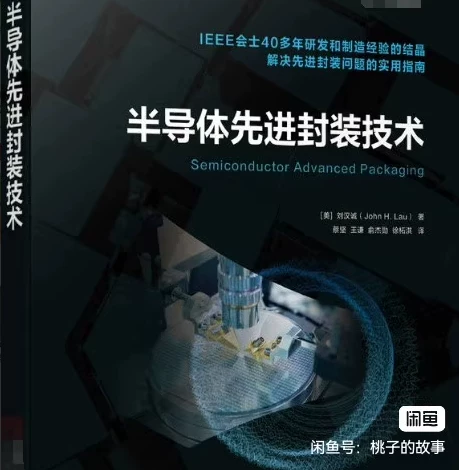
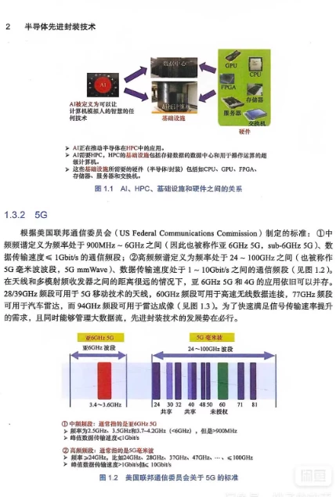
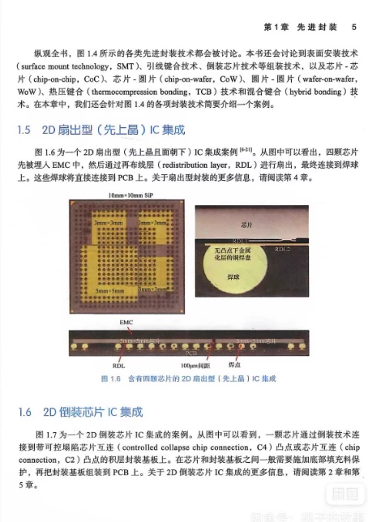
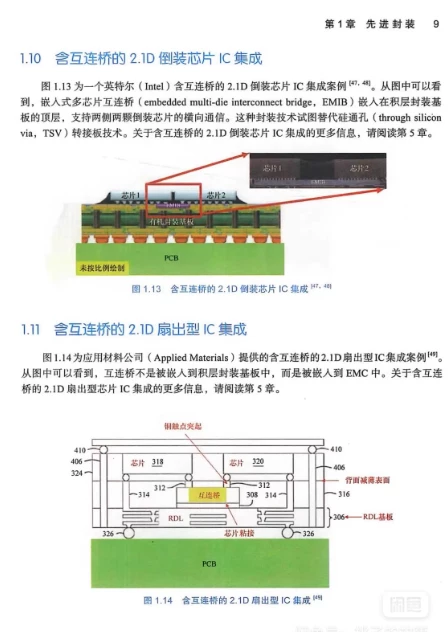
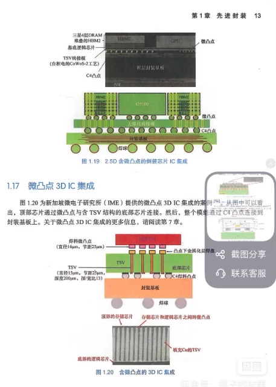

# Advanced Semiconductor Packaging Technology in 2023, a brand-new publication!

## Body

Pre-sold Advanced Semiconductor Packaging Technology, published in 2023, completely new!

Advanced Semiconductor Packaging Technology in 2023, a brand-new publication!

The book is divided into 11 chapters, covering advanced packaging, system-level packaging, fan-in and fan-out packaging, 2D to 3D IC integration, etc. Through learning, you can master the methods to solve advanced packaging problems.

【Shipping and Express Delivery】
- Ship within 24-48 hours

Interested friends welcome to privately chat, click "I want" to contact me!

"Advanced Semiconductor Packaging Technology" is a book that covers various packaging technologies, including 2D fan-out, 2.1D embedded multichip interconnect bridges, and 3D micro-bump integration. It is suitable for electronic engineers and students to use, with an easy-to-understand and rich case study content.

## Images

## Payment

Here is a pay link on Stripe ( https://buy.stripe.com/3cs8yP7sY87d0vu9AB ). Please contact me lonlonago@foxmail.com after funding $89, and I will send you a complete data files , thank you!

